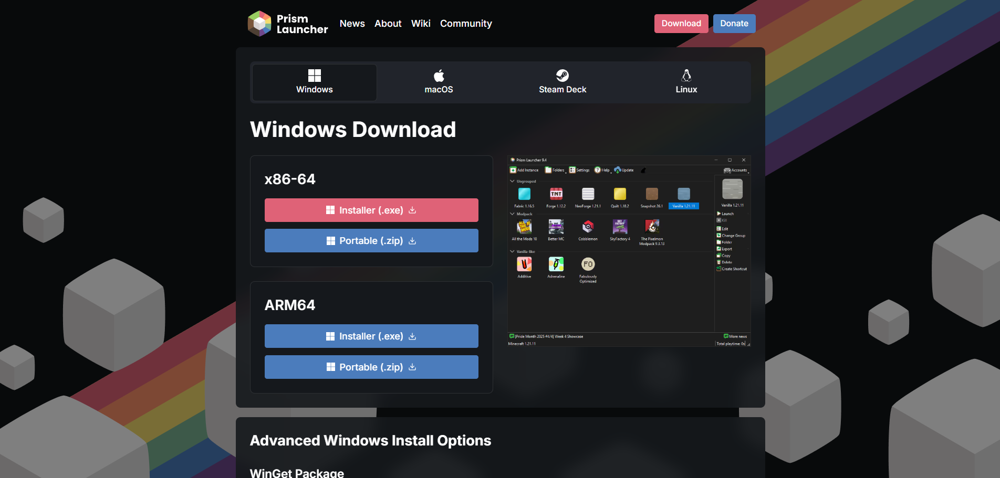
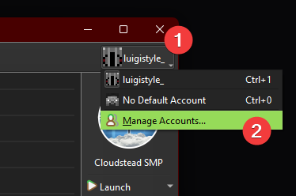
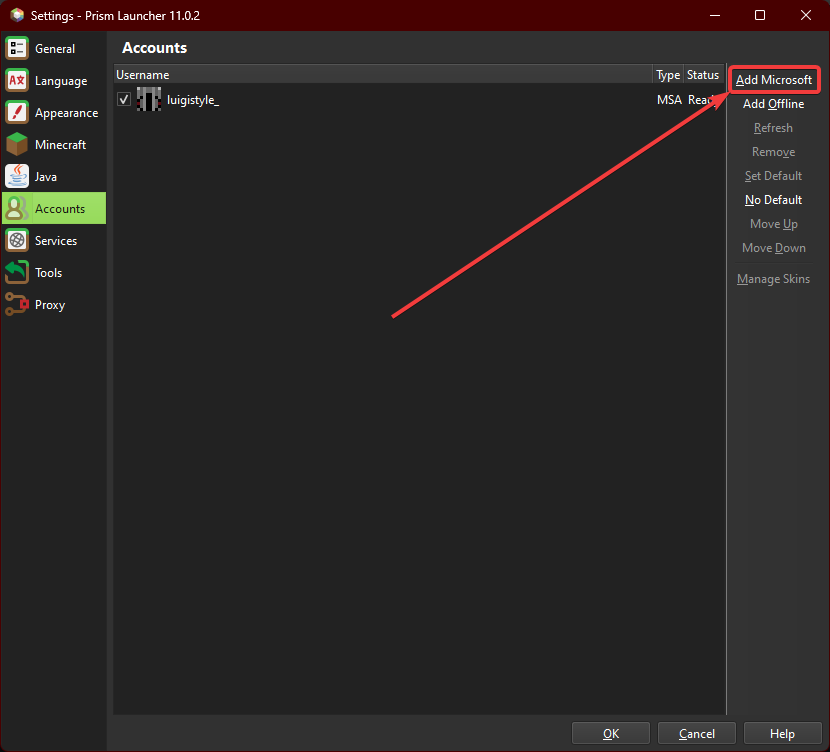
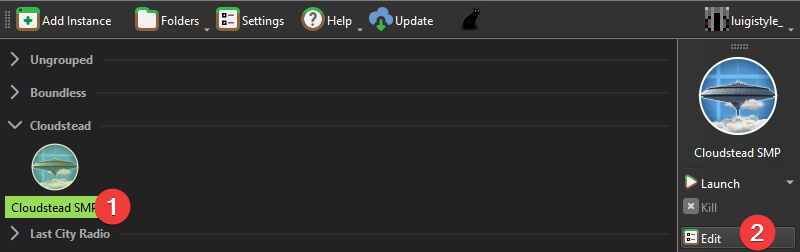
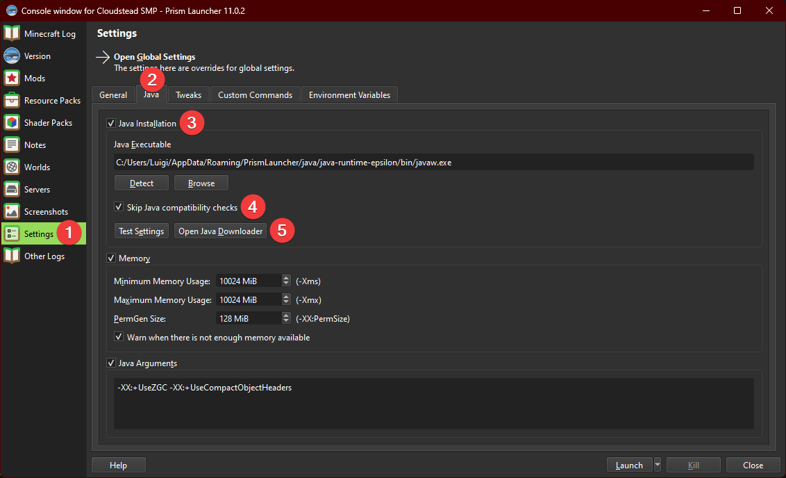
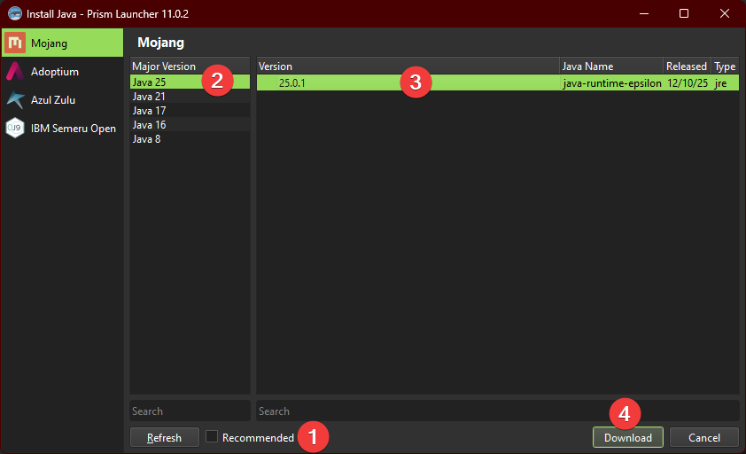
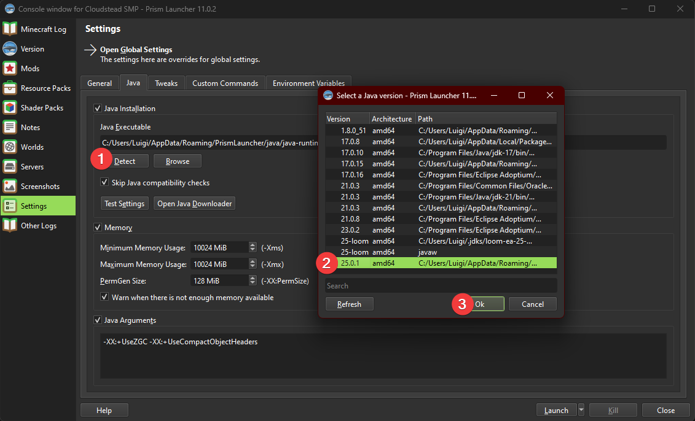

# Installation

## 1. Installing Prism Launcher

### Downloading the Launcher

1. Go to [Prism Launcher's downloads page](https://prismlauncher.org/download) and find the download matching your operating system:\
   

2. Download the installer, run it, and follow its instructions.

### Logging into your Minecraft account

1. Open the Prism Launcher, click on the Minecraft Skin icon on the top right,
   and hit "Manage Accounts"\
  

2. Hit "Add Microsoft" and follow the instructions to log in with your
   Microsoft account.\
  

## 2. Installing the Modpack

### Downloading the Modpack

[Download the modpack here](https://dl.modpack.luigistyle.com/Cloudstead%20SMP.zip).

1. Drag and drop the zip file into Prism Launcher
2. Hit OK at the bottom right.

### Downloading & Setting Java version

1. Left click the modpack and hit "Edit" on the menu that appears on the right side of the launcher.\
   

2. Go to Settings -> Java, and tick both the "Java Installation" and "Skip Java compatibility checks" boxes.\
   Now press the "Open Java Downloader" button.\
   

3. Untick the "Recommended" box, select Java 25 from the "Major Version" list, and download the latest version.\
   

4. Once the download is complete and you are back in your Java settings, click the "Detect" button and select the Java 25 installation that you just downloaded.\
   

You're now good to go! Close the settings, then double-click the modpack 
(or hit the launch button) to start.
